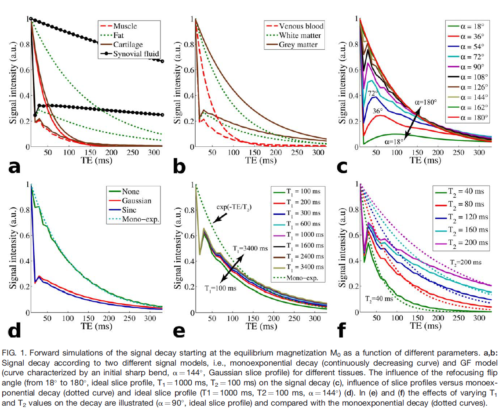

# MESE CPMG T2 MLE Fit

## Synopsis
Demonstration of maximum likelihood estimation (MLE) of transverse relaxation 
time (T2) from multi-echo spin-echo (MESE) Carr-Purcell-Meiboom-Gill (CPMG) 
magnetic resonance imaging (MRI) magnitude data by fitting a slice-profile 
corrected extended phase graph (EPG) signal calculated using generating 
functions (GF) and forward Shinnar-Le-Roux (SLR) transform.

## Background
The gold-standard technique for determining the T2 of a sample in MRI is a 
series of spin-echo measurements with varying echo times (TE), however, 
the acquisition time is often impractically long. Therefore, to save time, 
MESE-CPMG is used. However, because of stimulated echoes caused by 
B1-transmit inhomogeneity and non-ideal slice profiles, the measured 
signal cannot be modelled a simple exponential decay.

As explained by [Lebel et al. 2010](https://onlinelibrary.wiley.com/doi/full/10.1002/mrm.22487):
> The hall-mark of echo contamination, for any of the above reasons, is a 
> hypo-intense first echo (lacks stimulated echo contribution); subsequent 
> echoes display roughly mono-exponential relaxation, but with an
> artificially long time constant.

The MESE-CPMG signal, accounting for B1-transmit inhomogeneity and non-ideal 
slice profiles can be modelled in two different, but equivalent, ways:
1. Numerically using the extend phase graph (EPG) approach as described in [Lebel et al. 2010](https://onlinelibrary.wiley.com/doi/full/10.1002/mrm.22487). This is freely available as a [MATLAB](https://www.mathworks.com) package called [StimFit](https://mrel.usc.edu/sharing/).
2. Analytically using generating functions (GF) formalism as described in [Petrovic et al. 2015](https://onlinelibrary.wiley.com/doi/full/10.1002/mrm.25170)

However, both of these methods rely on non-linear least squares 
fitting. We have shown that maximum likelihood estimation (MLE) results in 
parameter estimates with reduced bias and higher precision 
[Zafeiropoulos et al. 2018 ](https://cds.ismrm.org/protected/18MProceedings/PDFfiles/2763.html).

>[!NOTE]
>The idea of using MLE for T2 relaxometry was first described by 
>[Bonny et al. 1996](https://onlinelibrary.wiley.com/doi/abs/10.1002/mrm.1910360216).
>The details of MLE of Ricean distributed parameters was described by [Sijbers et. al. 1999](https://ieeexplore.ieee.org/document/712125). 
>Alternative approaches to parameter estimation with MLE or least-squares have also been published, for example, 
>[Layton et. al. 2013](https://ieeexplore.ieee.org/document/6508949) used a Bayesian framework.

To the best of our knowledge there is no publicly available implementation 
of the GF formalism so we provide one here ([gf.py](./gf.py)). For convenience we also include
implementations of the forward SLR transform ([rftools.py](./rftools.py)) and MLE ([nll.py](./nll.py)) 
along with their associated unit tests ([test_gf.py](./test_gf.py), [test_nll.py](./test_nll.py) and 
[test_rftools.py](./test_rftools.py)).

>[!NOTE]
> Our implementation of the GF formalism includes two extensions (described in
> [Lebel et al. 2010](https://onlinelibrary.wiley.com/doi/full/10.1002/mrm.22487)) 
> to allow for: 
> - an array of excitation flip angles to account for imperfect signal excitation
> - an RF scaling factor to account for B1 transmit inhomogeneity

## Maximum Likelihood Estimation of T2 
As explained by [Gudbjartsson and Patz 1995](https://onlinelibrary.wiley.com/doi/abs/10.1002/mrm.1910340618) the signal in 
a MR magnitude image (i.e formed from the combination of real and imaginary channels which are both affected by Gaussian noise) 
follows a Rician distribution. The $N$ measurements (i.e. $N$ echoes) are independent, so the signal at the $i^{th}$ echo time 
has a Ricean probability density function (PDF):

```math
P(M_i | S_i,\sigma) = \frac{M_i}{\sigma^2} e^{-\frac{M_i^2+S_i^2}{2\sigma^2}}I_0\left(\frac{S_iM_i}{\sigma^2}\right)
```

Here $I_0$ is the modified zeroth order Bessel function of the first kind. $M$ is the measured signal, $\sigma$ is
the standard deviation of the noise in the real and imaginary channels (assumed to be constant across each times) 
and $S$ is the signal in the absence of noise i.e. the signal calculated using the GF formalism. As seen in ([gf.py](./gf.py)) 
$S$ is a function of the relaxation times of the tissue, $T_1$ and $T_2$, the scanner setting including the 
echo-spacing, $\tau$, number of echoes, $N$, signal scaling factor, $A$, flip-angle profiles of the RF 
excitation and refocusing pulses and any B1-inhomogeniety, $B_1$.  

Since the N measurements are independent the likelihood function, $L$, factorises:

```math
L(\mathbf{M}; S, \sigma) = \prod_{i=1}^N P(M_i | S_i,\sigma) = \prod_{i=1}^N \frac{M_i}{\sigma^2} e^{-\frac{M_i^2+S_i^2}{2\sigma^2}}I_0\left(\frac{S_iM_i}{\sigma^2}\right)
```

The best estimates of $\hat{S}$ and $\hat{\sigma}$ are given by the values of 
$S$ and $\sigma$ for which the likelihood, $L$, is maximised. In practice, however, 
it is more practical to find the minimum of the negative log likelihood.

```math
-\ln L(\mathbf{M}; S, \sigma) = - \sum_{i=1}^N ln \left( \frac{M_i}{\sigma^2} e^{-\frac{M_i^2+S_i^2}{2\sigma^2}}I_0\left(\frac{S_iM_i}{\sigma^2}\right)\right)
```
As shown in ([nll.py](./nll.py)), if we know $T_1$, $\tau$ and $N$ as well as the the flip-angle 
profiles of the excitation and refocusing RF pulses then the best estimates of $\hat{A}$, $\hat{T_2}$, 
$\hat{B_1}$ and $\hat{\sigma}$ are given by the values of $A$, $T_2$, $B_1$ and $\sigma$ for which 
the negative log likelihood is minimised.

>[!NOTE]
> As explained by [Aja-Fernández et. al. 2013](https://www.sciencedirect.com/science/article/abs/pii/S0730725X13003810) the signal
> in MR magnitude images calculated from multi-channel coils, or using parallel imaging such as SENSE or GRAPPA no longer follows
> a Rician distribution therefore the PDF would need to be replaced e.g. with a non-central chi distribution.

## Demonstration
To test of our implementation of the GF formalism we include a Colab notebook which 
can be used to reproduce Figure 1 of [Petrovic et al. 2015](https://onlinelibrary.wiley.com/doi/full/10.1002/mrm.25170) [](https://colab.research.google.com/github/SWastling/mese_cpmg_t2_mle/blob/main/mese_cpmg_t2_mle.ipynb)



In addition the notebook demonstrates the MLE of T2 from simulated data. 

## License
See [MIT license](./LICENSE)

## Author and Acknowledgements
Written by [Dr Stephen Wastling](mailto:stephen.wastling@nhs.net) after many 
helpful discussions with 
[Dr Nick Zafeiropoulos](https://profiles.ucl.ac.uk/42604-nick-zafeiropoulos) 
and [Professor John Thornton](https://profiles.ucl.ac.uk/4525-john-thornton) 
from [UCL](https://www.ucl.ac.uk/ion/research/research-departments/department-brain-repair-and-rehabilitation)
as well as [Dr Matt Hall](https://www.npl.co.uk/people/matt-hall), 
Dr Matt Cashmore and Dr Nadia Smith from [NPL](https://www.npl.co.uk/).

With many thanks to [John Pauly](https://web.stanford.edu/~pauly/) for making 
the [rf_tools](http://rsl.stanford.edu/research/software.html) package publicly 
available.
